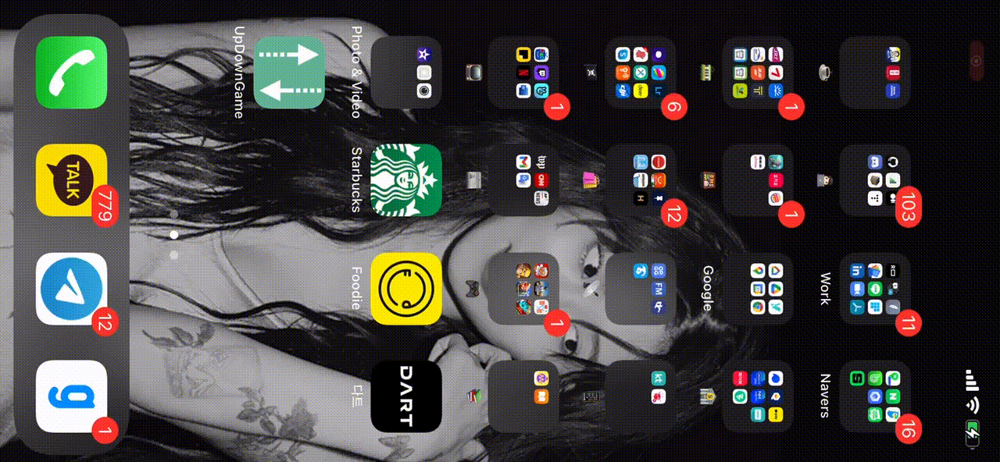

# Study Swift

Swift을 공부하는 프로젝트입니다.

## [**Swift-야곰**](https://yagom.github.io/swift_basic/)
- [Swift - 강좌소개](https://yagom.github.io/swift_basic/contents/00_introduction/) 2020.12.23 완료
- [Swift - 이름짓기, 콘솔로그, 문자열 보간법](https://yagom.github.io/swift_basic/contents/00_introduction/console_log/) 2020.12.23 완료
- [Swift - 상수와 변수](https://yagom.github.io/swift_basic/contents/01_let_var/) 2020.12.23 완료
- [Swift - 기본 데이터 타입](https://www.youtube.com/watch?v=3qu7gpzE9IE&list=PLz8NH7YHUj_ZmlgcSETF51Z9GSSU6Uioy&index=4) 2020.12.24 완료
- [Swift - Any, AnyObject, nil](https://www.youtube.com/watch?v=1QV4-B5ibd4&list=PLz8NH7YHUj_ZmlgcSETF51Z9GSSU6Uioy&index=5) 2020.12.24 완료

## [**iOS for Starter📱-야곰**](https://www.youtube.com/playlist?list=PLz8NH7YHUj_ZF2oja5rP4Sow5KK1zf2yk)

- iOS App Programming for Starter - Introduction 2020.12.24 완료
- iOS App Programming for Starter - Project Overview 2020.12.24 완료
- iOS App Programming for Starter - Lessons 1 Introduction 2020.12.24 완료
- iOS for Starter - Creating iOS App Project 2020.12.24 완료
- iOS for Starter - Drawing up ProjectTo-Do List 2020.12.24 완료
- iOS for Starter - Lessons 2 Introduction 2020.12.24 완료
- iOS for Starter - UIKit and Storyboard 2020.12.24 완료
- iOS for Starter - Adding UI Components on the Storyboard 2020.12.24 완료
- iOS for Starter - Adding Slider and HIT Button 2020.12.24 완료
- iOS for Starter - Receiving Value Changed Event from the Slider 2020.12.24 완료
- iOS for Starter - Action and Outlets 2020.12.24 완료
- iOS for Starter - Event-driven Programming 2020.12.24 완료
- iOS for Starter - Wrapping up 2020.12.24 완료
- iOS for Starter - Lesson3 Introduction 2020.12.24 완료
- iOS for Starter - Adding label 2020.12.24 완료
- iOS for Starter - [**Challenge**] Changing label's font 2020
.12.24 완료
- iOS for Starter - Importing Assets 2020.12.24 완료
- iOS for Starter - Assets 2020.12.25 완료 / Happy Christmas🎄
- iOS for Starter - Styling UI 2020.12.25 완료
- iOS for Starter - [**Challenge**] SF Symbools 2020.12.25 완료
- iOS for Starter - Auto Layout 2020.12.25 완료
- iOS for Starter - [**Challenge**] Auto Layout 2020.12.25 완료
- iOS for Starter - limitations of Storyboard 2020.12.25 완료
- iOS for Starter - Wrapping up 2020.12.25 완료
- iOS for Starter - Comments 2020.12.25 완료
- iOS for Starter - Doing Someting : Functions 2020.12.25 완료
- iOS for Starter -[**Challenge**] Implementing Function
- iOS for Starter - Values : Variables 2020.12.25 완료
- iOS for Starter - Declaring variables 2020.12.25 완료
- iOS for Starter - [**Challenge**] Declaring variables 2020.12.25 완료
- iOS for Starter - Random Numbers 2020.12.25 완료
- iOS for Starter - Lessons4 Wrapping Up 2020.12.25 완료
- iOS for Starter - Lessons5 Introduction 2020.12.25 완료
- iOS for Starter - Changing Value to another type 2020.12.25 완료
- iOS for Starter - String Interpolation 2020.12.25 완료
- iOS for Starter - Comparing Values 2020.12.25 완료
- iOS for Starter - [**Challenge**] If
- iOS for Starter - Terminating functions : return 2020.12.25 완료
- iOS for Starter - Conditional execution 2020.12.25 완료
- iOS for Starter - Showing Alerts 2020.12.25 완료
- iOS for Starter - Lessons5 Wrapping Up 2020.12.25 완료
- iOS for Starter - Lessons6 Introduction 2020.12.26 완료
- iOS for Starter - Creating a New Scene 2020.12.26 완료
- iOS for Starter - Composing Credit View 2020.12.27 완료
- iOS for Starter - Storyboard Segue 2020.12.27 완료
- iOS for Starter - Writing a Close Button Method 2020.12.27 완료
- iOS for Starter - [**Challenge**] Connecting the Button Action 2020.12.27 완료
- iOS for Starter - Running the App on my Devices 2020.12.27 완료
- iOS for Starter - Where to Go From Here? 2020.12.27 완료
- iOS for Starter - Lessons6 Wrapping Up 2020.12.27 완료

**최종 완료: 2020.12.27**

### To-Do List
- [X] 1. Add Slider 2020.12.24 완료  
- [X] 2. Add 'HIT Button' 2020.12.24 완료  
- [X] 3. Recevie value changed events from the slider 2020.12.24 완료  
- [X] 4. Add 'RESET Button' 2020.12.24 완료  
- [X] 5. Add labels presenting information  
- [X] 6. Generate the random number  
- [X] 7. Compare the random number with input number  
- [X] 8. show alert  
- [X] 9. Implement 'reset' feature  
- [X] 10. App 'Credit' View  

## Notion 📚
- [이름짓기, 콘솔로그, 문자열 보간법](https://www.notion.so/hyunsang0625/3b2c2bc5199e48608743a40fed9e02a7)
- [상수와 변수](https://www.notion.so/hyunsang0625/442580b3e09147bfabc8cc55fa5f852d)
- [기본 데이터 타입](https://www.notion.so/hyunsang0625/b08cb2733def41aa926e5ac5bb7ccbaa)
- [Asset Types](https://www.notion.so/hyunsang0625/Asset-Types-29549bd2c016474b92e77a15c6af9d03)
- [Auto Layout](https://www.notion.so/hyunsang0625/Auto-Layout-c6350953b510480b90145f9094d01b84)
- [Variabels & Constants](https://www.notion.so/hyunsang0625/Variabels-Constants-3839d45ea0ce43889dafba812bb4ef50)
- [Range Operators](https://www.notion.so/hyunsang0625/Range-Operators-89dcafcd26d942d8a2e4d2bef8ae2e3f)